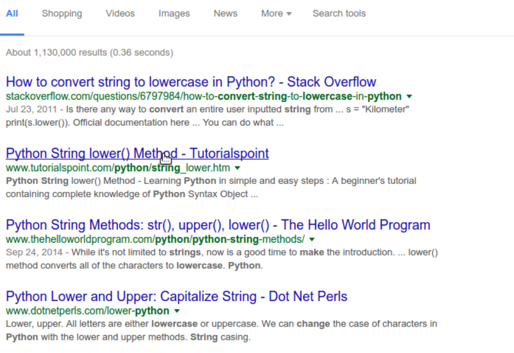

← [Doing Things to Lists](10-doing-things-to-lists.md)&nbsp;&nbsp;&nbsp;|&nbsp;&nbsp;&nbsp;[A Little Motivation](12-a-little-motivation.md) →

---

# 11. Finding Answers with Google

Our library app is working pretty well, but you may have noticed that it's case sensitive:

```
What do you want to do with your books today?
Sort
I don't know what you want me to do!
```

How could we fix our program to handle cases like this? We could add a bunch of new `elif` statements, like this:

```python
...
elif response == "Sort":
    library.sort()
    print(library)
elif response == "SORT":
    library.sort()
    print(library)
...
```

This is a lot of work, and it's a pretty ugly solution. If we wanted to add more cases to our program, we would have to write them in twice every time, and it still wouldn't fix inputs like `SorT`. The best way to improve our program would be to convert the input to lower case before we send it to our `if/else` block.

## Googling for Answers

Even if you're a super rad Python programmer, you're not going to remember every function name or how to do things you might not have touched in awhile. One thing programmers get very good at is googling for answers. In fact, this is arguably the most important skill in modern-day programming. So let's use Google to find out how to convert strings to lower case.

Let's try the search term [make string lowercase](http://lmgtfy.com/?q=make+string+lowercase+Python):


While Google searches change over time, some of your results likely come from a site called Stack Overflow. This is a questions and answers site for programmers that usually has strong answers to questions about Python.



On [this _Stack Overflow_ page](https://stackoverflow.com/questions/6797984/how-do-i-lowercase-a-string-in-python), take a quick look at the question to make sure it's relevant to your problem. Then scroll down to the answers to find what we're looking for. You may also notice snarky debates—another "feature" of _Stack Overflow_.

## Implementing Our Answer

According to this answer, we can make a string lowercase by adding `.lower()` to the end of it, like this:

```pycon
>>> "SORT".lower()
'sort'
```

OK, that seems to work. Let's incorporate this transformation into our library app:

```python
library = ["Orlando", "Confessions of the Fox", "These Waves of Girls"]
response = input("What do you want to do with your books today? ")
response = response.lower()

if response == "sort":
    library.sort()
    print(library)
elif response == "add":
    library.append("La Frontera")
    print(library)
elif response == "remove":
    library.pop()
    print(library)
else:
    print("I don't know what you want me to do!")
```

This new script should handle any combination of upper or lowercase characters. The new second line sets the response variable to a new value, `response.lower()`, which is a lowercase version of the original input.

There's no shame in googling for answers! Error messages are especially useful to google when you run into them. Keep an eye out for _Stack Overflow_ answers, as they tend to have useful examples. The [official Python documentation](https://docs.python.org/3/) will also frequently come up, but I would recommend avoiding it as a resource until you have more programming experience. It's a great resource, but the way information is presented can be confusing until you get the hang of reading documentation.

Before moving on to the next section, complete the first challenge below. This challenge will teach the skills necessary to complete write more advanced scripts in this workshop.

## Challenge

*Note: the first challenge is **required** in order to complete further sections.

1. We are going to use `while` loops to get Python to repeat loops over and over again. This involves adding a `while` statement to your library app. The code should look like this, and it goes right after the `library` list and before your `input` statement.

    ```python
    while True:
        ...
    ```

    Make sure that everything under `while True:` is indented (this creates a "code block," or a group of lines that will be executed together).

    To stop the loop, you can press <kbd>control</kbd> + <kbd>c</kbd> in the terminal. This stops the program from being run, what we call "interrupting" the program. You can also add a `break` statement somewhere in your code which will automatically exit the program. For example:

    ```python
        if response == "sort":
            library.sort()
            print(library)
            break
        ...
        else:
            print("I don't know what you want me to do!")
    ```

    Once you get the loop to work, you can add more `elif` statements to add more books to the list. Then, run the program, adding books, sorting them and removing them. Read more about `while` loops [here](https://www.w3schools.com/python/python_while_loops.asp).

2. (optional) OK, I told you not to look at the Python documentation. But doesn't that make you really want to go look at the Python documentation? How bad could this "documentation" really be? What terrible secrets might it hold?

    Fine. Have a look at the [Python documentation on built-in functions](https://docs.python.org/3/library/functions.html). Don't say I didn't warn you.

## Solution

1. Here's how you would include a `while` statement in our library application:

    ```python
    library = ["Orlando", "Confessions of the Fox", "These Waves of Girls"]
    while True:
        response = input("What do you want to do with your books today? ")
        response = response.lower()
        if response == "sort":
            library.sort()
            print(library)
        elif response == "add":
            library.append("La Frontera")
            print(library)
        elif response == "add again":
            library.append("In the Dreamhouse")
            print(library)
        elif response == "more books":
            library.append("Giovanni's Room")
            print(library)
        elif response == "moar":
            library.append("Nightwood")
            print(library)
            break
        elif response == "remove":
            library.pop()
            print(library)
        else:
            print("I don't know what you want me to do!")
    ```

## Evaluation

If we wanted to make a string like `'hello'` uppercase, we would use the method `upper()`, in the following way:
- `upper('hello')`
- `upper().'hello'`
- `'hello'.upper()`*
- `'hello'(upper)`

## Keywords

Do you remember the glossary terms from this section?

- [lower()](https://github.com/DHRI-Curriculum/glossary/blob/v2.0/terms/lower.md)
- [Method](https://github.com/DHRI-Curriculum/glossary/blob/v2.0/terms/method.md)

---

← [Doing Things to Lists](10-doing-things-to-lists.md)&nbsp;&nbsp;&nbsp;|&nbsp;&nbsp;&nbsp;[A Little Motivation](12-a-little-motivation.md) →